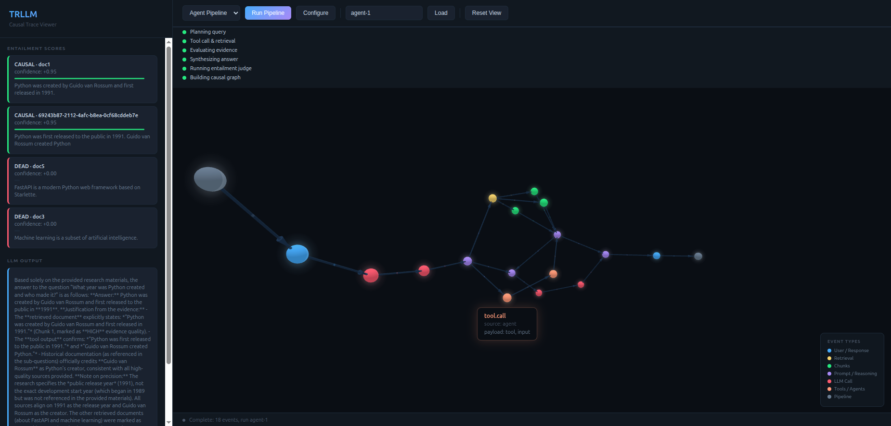

# TRLLM

Causal tracing for LLM and agent pipelines.

TRLLM reconstructs **causal relationships** in LLM pipeline executions. Unlike tracing tools that capture chronological spans, TRLLM answers: *which inputs actually caused which outputs?*

Built on [PyRapide](https://pypi.org/project/pyrapide/) — a causal event-driven architecture library based on Stanford's RAPIDE 1.0 specification.



## The Problem

When an LLM agent pipeline runs (retrieval → reasoning → tool calls → synthesis), existing observability tools show you a timeline. They cannot tell you:

- Which retrieval chunk actually influenced the final output
- Whether a tool call was causally relevant or dead weight
- What the minimum causal path from query to answer looks like
- If you removed a data source, which outputs would lose their grounding

TRLLM fills this gap by modeling pipeline executions as **causal posets** — directed acyclic graphs where edges represent causal influence, not just temporal sequence.

## How It Works

1. **Instrument** your LLM pipeline to emit `CLEvent` objects at each step (query, retrieval, chunk injection, LLM call, tool use, final response)
2. **Build** a causal graph — explicit causal links from your pipeline + inferred links from the **Entailment Linker**, which uses an LLM judge to verify whether specific claims in the output actually came from each input
3. **Query** the graph — trace causes, find dead nodes, compute shortest causal paths, run counterfactual analysis
4. **Enforce constraints** — declarative rules like "every output must be grounded in at least one retrieved chunk"

## Quick Start

### Requirements

- Python 3.11+
- [Ollama](https://ollama.ai) running locally (for the demo and entailment judge)

### Install

```bash
python -m venv .venv
source .venv/bin/activate
pip install -e ".[dev]"
```

### Pull Ollama Models

```bash
ollama pull qwen3:8b              # LLM for demo pipeline
ollama pull qwen3-embedding:0.6b   # Embeddings for retrieval in demo
```

### Run the Dashboard

```bash
uvicorn trllm.api.server:app --reload
```

Open `http://localhost:8000/dashboard`, enter your own query and documents (or use the defaults), and click **Run Pipeline**. The agent pipeline plans the query, runs tool calls and retrieval in parallel, evaluates evidence, and synthesizes an answer. The dashboard streams progress in real time via SSE and renders an interactive 3D force-directed graph you can orbit, zoom, and click to trace causal ancestry.

### Run with Docker

```bash
docker compose up --build
```

The container exposes port 8000 and connects to Ollama on the host via `OLLAMA_HOST`.

### Run the CLI Demo

```bash
python demo/demo_pipeline.py
```

This runs the same agent pipeline as the dashboard: query planning, parallel tool call + retrieval, evidence evaluation, synthesis, and entailment scoring. Output shows which inputs were causally relevant, which were dead weight, and whether any constraints were violated.

**Reading the output:**
- **CAUSAL** — the LLM judge determined that specific claims in the output came from this input (e.g. "Phobos and Deimos" and "Asaph Hall in 1877" trace back to doc1).
- **DEAD** — this input was present in the prompt but no specific information from it appears in the output. Dead weight.
- **HALLUCINATED_AGAINST** — the output directly contradicts a fact in this input (negative confidence score).
- **Confidence scores** reflect the judge's assessment of how strongly the input contributed to the output.

### Run Tests

```bash
pytest tests/ -v
```

Tests use mocked Ollama calls — no running Ollama instance required.

## Dashboard

The built-in dashboard at `/dashboard` provides:

- **Custom inputs** — enter your own query, paste your own documents (one per line), choose LLM/embed models, and set top-K retrieval count
- **Agent pipeline** — multi-step branching graph: planning LLM, parallel tool call + retrieval, evidence evaluation, synthesis LLM
- **3D causal graph** — interactive force-directed graph (Three.js + 3d-force-graph) with glowing nodes, orbit controls, and animated causal flow particles
- **Causal ancestry tracing** — click any node to highlight its full causal ancestry with a camera fly-to
- **Streaming execution** — real-time SSE progress updates as the pipeline runs
- **Entailment scores** — sidebar showing per-chunk causal/dead/hallucinated verdicts with confidence bars
- **Constraint violations** — live constraint checking results

## API Endpoints

| Method | Path | Description |
|--------|------|-------------|
| `POST` | `/ingest` | Submit a pipeline run (events) for causal analysis |
| `POST` | `/query` | Query the causal graph (`what_caused`, `dead_nodes`, `min_path`, `counterfactual`) |
| `GET` | `/runs/{id}/visualization` | Get Mermaid, ASCII, or DOT visualization |
| `GET` | `/runs/{id}/constraints` | Check constraint violations |
| `GET` | `/runs/{id}/graph` | Get graph nodes and edges for visualization |
| `POST` | `/demo/run` | Run a pipeline with custom query/documents (SSE stream) |
| `GET` | `/dashboard` | Interactive 3D causal trace viewer |

## Project Structure

```
trllm/
├── trllm/
│   ├── tracer.py          # High-level Tracer SDK
│   ├── events.py          # CLEvent schema, 17 EventType values
│   ├── graph.py           # CausalGraphBuilder → PyRapide Computation
│   ├── linker.py          # EntailmentLinker (LLM judge-based causal verification)
│   ├── constraints.py     # Pipeline constraints via PyRapide patterns
│   ├── adapters/
│   │   └── ollama.py      # Async Ollama HTTP adapter (supports OLLAMA_HOST env var)
│   ├── api/
│   │   ├── models.py      # Pydantic request/response models
│   │   └── server.py      # FastAPI endpoints + SSE demo runner
│   └── visualization/
│       └── renderer.py    # PyRapide visualization wrappers
├── demo/
│   └── demo_pipeline.py   # End-to-end agent pipeline demo (CLI)
├── tests/                 # 45 tests (all mocked, no Ollama needed)
├── dashboard/
│   └── index.html         # 3D force-directed causal graph viewer
├── Dockerfile
├── docker-compose.yml
└── pyproject.toml
```

## Instrumenting Your Own Pipeline

Use the `Tracer` SDK to add causal tracing to any pipeline:

```python
import asyncio
from trllm import Tracer

async def my_pipeline():
    async with Tracer(llm_model="qwen3:8b") as tracer:
        with tracer.trace() as t:
            # Record each step of your pipeline
            t.query("How many moons does Mars have and what are their names?")
            t.chunk("doc1", "Mars has two small moons called Phobos and Deimos, discovered in 1877.")
            t.chunk("doc2", "Mars has three moons: Phobos, Deimos, and Titan.")
            t.tool_call("lookup", input="mars moons", output="Mars has two moons: Phobos and Deimos.")
            t.llm_call(prompt="Context: ... Question: How many moons does Mars have?", response="Mars has two moons: Phobos and Deimos...")
            t.response("Mars has two moons: Phobos and Deimos.")

        # Analyze: builds causal graph, runs entailment judge, checks constraints
        result = await tracer.analyze()

        for s in result.scores:
            print(f"[{s['verdict']}] {s['chunk_id']}: {s['confidence']:+.2f}")
        for v in result.violations:
            print(f"VIOLATION: {v}")

asyncio.run(my_pipeline())
```

The `Tracer` handles all the wiring: event creation, causal linking, graph construction, entailment scoring, and constraint checking. Each method (`query`, `chunk`, `tool_call`, `llm_call`, `response`, `reasoning`, `agent_delegate`) records an event and automatically links it to the previous step. You can also pass explicit `caused_by` lists for custom causal structures.

For advanced use cases, the lower-level `CLEvent`, `CausalGraphBuilder`, `EntailmentLinker`, and `check_constraints` APIs are still available.

## Event Types

TRLLM supports 17 event types covering the full lifecycle of agent pipelines:

| Category | Event Type | Description |
|----------|-----------|-------------|
| Pipeline | `PIPELINE_START`, `PIPELINE_END` | Pipeline lifecycle boundaries |
| User | `USER_QUERY`, `FINAL_RESPONSE` | Input from user, final output to user |
| Retrieval | `RETRIEVAL_REQUEST`, `RETRIEVAL_RESULT` | Vector search request and raw results |
| Retrieval | `CHUNK_SELECTED`, `CHUNK_INJECTED` | Chunk picked from results, chunk added to prompt |
| LLM | `LLM_REQUEST`, `LLM_RESPONSE`, `PROMPT_ASSEMBLED` | Full LLM call lifecycle |
| Tools | `TOOL_CALL`, `TOOL_RESULT` | Tool invocation and its output |
| Agents | `AGENT_DELEGATE`, `AGENT_RESPONSE` | Sub-agent delegation and response |
| Reasoning | `REASONING_STEP`, `SYNTHESIS` | Chain-of-thought steps, final synthesis |

## Key Concepts

**Entailment Linker** — The core differentiator. Instead of cosine similarity (which only measures topical overlap — a hallucinated response about Python scores just as high as a grounded one), the linker uses an LLM judge to trace each specific claim in the response back to its source chunk. This catches:
- **True grounding** — "response says Phobos and Deimos, chunk says Phobos and Deimos" → CAUSAL
- **Dead weight** — chunk about Olympus Mons, response doesn't use it → DEAD
- **Hallucination** — "response says two moons, chunk says three moons including Titan" → HALLUCINATED_AGAINST (negative score)

One judge call evaluates all chunks at once. The same model used for generation can serve as the judge.

**Causal Graph Builder** — Combines explicit causal links (from your pipeline instrumentation) with inferred links (from the entailment linker) into a PyRapide `Computation`. Supports both Engine-driven (live) and post-hoc (recorded) graph construction.

**Constraints** — Declarative rules using PyRapide's pattern algebra (`>>` for causal sequence):
- Every final output must be grounded in a retrieved chunk
- Every tool call must produce a result
- Every LLM response must have a preceding request

Constraints are **context-aware** — they only fire when the relevant event types are present. A `tool_completion` constraint won't trigger in a pipeline that never makes tool calls.

## Tech Stack

- **PyRapide** — causal event modeling (posets, patterns, constraints, visualization)
- **Ollama** — local LLM inference + embeddings
- **FastAPI** — async API layer with SSE streaming
- **Three.js / 3d-force-graph** — interactive 3D causal graph visualization
- **httpx** — async HTTP client
- **numpy** — cosine similarity (retrieval in demo)
- **Docker** — containerized deployment

## License

MIT
